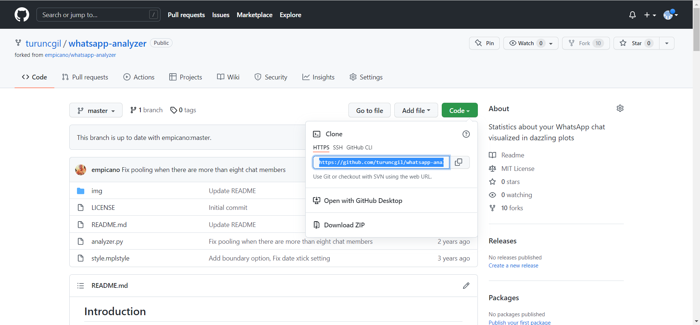
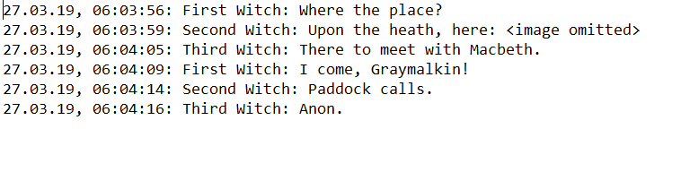
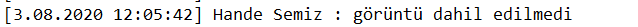
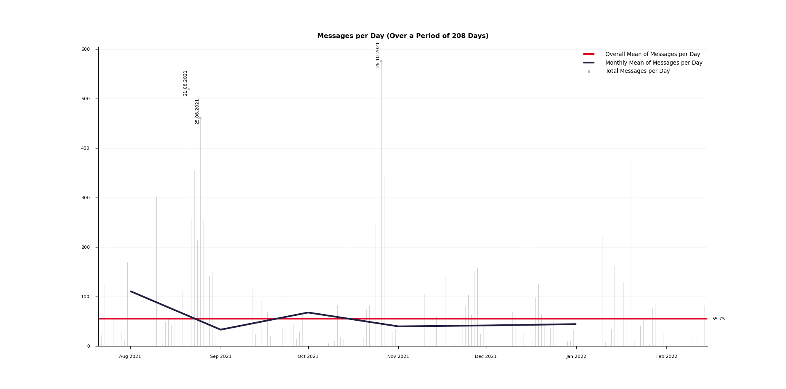
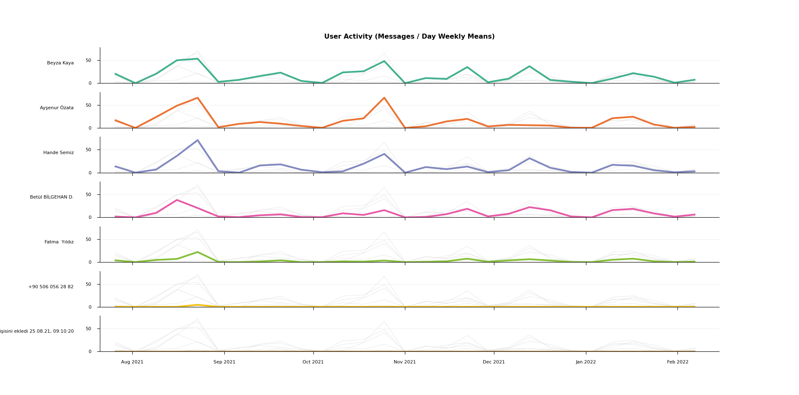
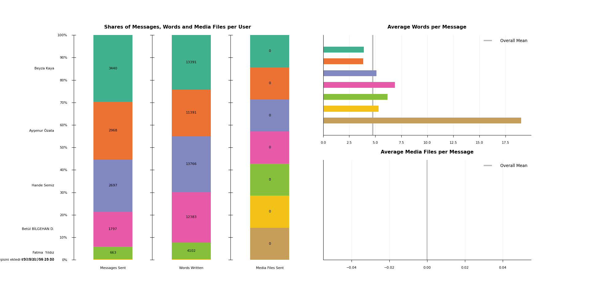
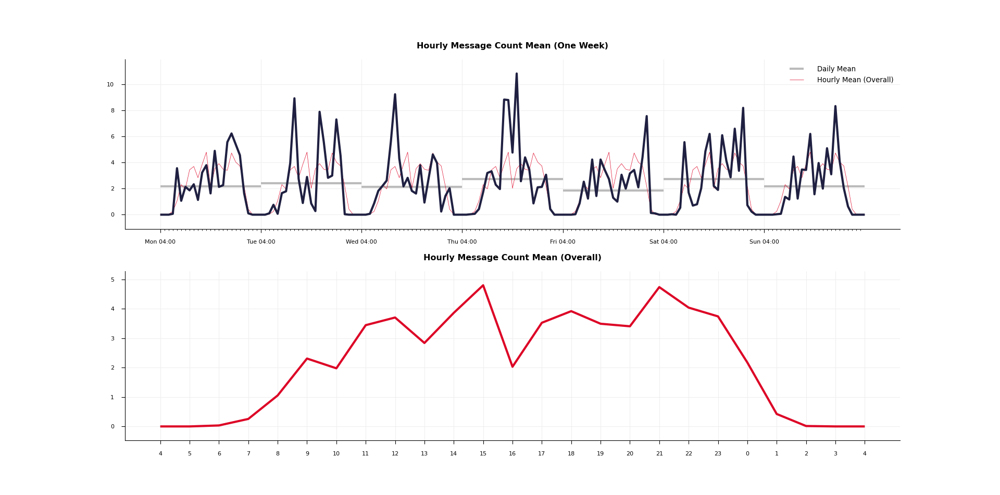
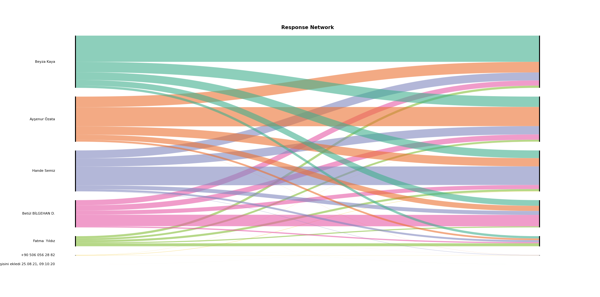

***To see additional text for DSSIPD, please see the end of READ.me file***
## Introduction
WhatsApp-Analyzer is a statistical analysis tool for WhatsApp chats. Working on the chat files that can be exported from WhatsApp it generates various plots showing, for example, which other participant a user responds to the most.

## List of Plots

### Trend

In this plot we can see in gray the raw number of messages for every day (the three dates with the most messages annotated), in blue the monthly mean of messages per day and in red the overall mean of messages per day. The matplotlib zoom function in the lower left corner can be helpful to explore the graph.

### Activity

The activity plot shows the weekly means of messages per day for every user. Based on this we can explore in which periods different participants were the most (or the least) active. For easier comparison the graphs of all other users are displayed each time in addition to the main plot in light gray. Users are sorted by total message count, their order and color stays the same across all following plots.

### Shares

This graphic shows three different plots. On the left side we see the shares of messages, words and media files per user, each annotated with the real value. On the right side we can find two bar plots exposing in more detail the relationship between those three values.

In this particular case we could for example discover that although the pink user has written less messages than the violet user, because of his tendency to write long messages containing an above average number of media files, in total he has written more text and has sent more media files than the violet user.

### Times

In the upper plot we can see for every hour of the week the average message count. In our example graph we could for instance spot that during the night the conversation normally comes to a halt and that friday and saturday evening are on average by far the busiest times in the group. Plotted in gray we find the daily mean of messages. Factoring this in we could argue that whilst friday and saturday evening are usually both equally busy, on the first are still sent the most messages overall.

The lower plot displays the hourly mean of messages on a day. It is additionally shown in the upper plot in the same color for the purpose of easier comparison.

### Network

This alluvial diagram shows how often users respond to each other. A line from left to right represents the number of responses of the user on the left to messages of the user on the right. A vertical line thus represents answers to oneself, that is to say consecutive messages from the same user. As response to message M is seen the message that follows M in the chat (the first message in the chat doesn't respond to anything).

## Instructions
To get started, export the chat file that you want to analyze to your computer. To do that, open WhatsApp on your mobile phone and select the desired chat. Under **group / contact info** you will find the button **export chat**. Choose **without media**.

WhatsApp is very inconsistent with the format of exported files. Depending on mobile phone OS and language, the time, date and status message format will be different. This program expects the following format:

```
dd.mm.yy, hh:mm:ss: Third Witch: That will be ere the set of sun.
27.03.19, 06:03:56: First Witch: Where the place?
27.03.19, 06:03:59: Second Witch: Upon the heath, here: <image omitted>
27.03.19, 06:04:05: Third Witch: There to meet with Macbeth.
27.03.19, 06:04:09: First Witch: I come, Graymalkin!
27.03.19, 06:04:14: Second Witch: Paddock calls.
27.03.19, 06:04:16: Third Witch: Anon.
```

Run `python3 analyzer.py [file path] <start date> <end date>` in your terminal to start the analysis.

**Needed Dependencies:** [matplotlib](https://matplotlib.org), [numpy](http://www.numpy.org)

## Remarks
- Media files are recognized on the basis of their **<image** **omitted>** (video, sticker, ... respectively) tag in the message. Keep this in mind when preparing the chat file for analysis.
- You have the option to give boundary dates (both included, format: **dd.mm.yyyy**) as arguments to the program. This makes it easier to, for example, compare outputs for different years. Both dates have to be given, if not, the program falls back to using the date of the first and last message as boundaries.
- As people sometimes go to bed (and thus write messages) after midnight, a notion of a day from 00:00 to 23:59 would not represent the data in an optimal way. For all statistics days therefore begin at 04:00 in the morning and correspondingly end at 03:59 the day after. You can change this notion by setting the **DAYSTART** variable at the top of the **analyzer.py** file.
- If there are more than eight participants to a group, only the seven most active ones are shown in the plots, the rest gets pooled together to keep the plots from getting confusing.
- The color palette can be modified at the top of the **analyzer.py** file.
- New line characters in messages are not a problem, before analyzing a message they are converted to whitespace.
- The program could easily be adjusted to analyse other communication means than WhatsApp chats (e.g. emails). Either one brings the data in the earlier on discussed form, or one changes the way the program reads in the data (see the **Text** class in the **analyzer.py** file for this).

# How to Run It / for DSSIPD class
- As first step, go to [original repo](https://github.com/empicano/whatsapp-analyzer), and fork the repo

- Go to your account and find the repo you have forked, then copy HTTPS code

- Gitbash your repos folder (or where you like to locate the file), clone the repo with this code
    
    git clone [link to your repo]

- Open Anaconda and select the environment you like to work with and install dependencies with this codes
    
    pip install numpy
    
    pip install matplotlib
 
- Export the whatsapp chat you like to analyse
- Run the code with this command:
    
    python3 analyzer.py [file path] <start date> <end date>

## Problems on the way

- Did not accepted python3 as a command, changed it to python
- Did not read the file format of whatsapp chat, because whatsapp uses different export formats for different operation sytems and devices
    -Used the examples from repo untill I get a result
    -Then asked the whole group members for an export, turned out IOS has closer format to the example than Android
    
    *** Format Example ***
    
    
    
    *** Android Format ***
    
    
    
    *** Android Format ***
    
    
    
    
    Modified the things by using **replace** tool on text editor to reach out to example
- Run the code again had an error
    
    *UnicodeDecodeError: 'charmap' codec can't decode byte X in position Y: character maps to <undefined>*
    
    After researches, learned that spesifying decoder fixes this mistake, changed line 121 
    
    from *with open(path) as chat:* to **with open(path, encoding="utf-8") as chat:**
- And finally had another mistake which 
    
    *ValueError: The number of FixedLocator locations (8), usually from a call to set_ticks, does not match the number of ticklabels (7)*
    
    The error was on line 398, so I guessed there could be a mistake, 
   
    ***ax.set_xticks(range(0, 24 * 8), minor=True)***
    
    on previous line the code has 24 * 7 as values when I changed the code to 24 * 7 it worked.
## Results
### Trend

### Activity

### Shares 

### Times

### Network

